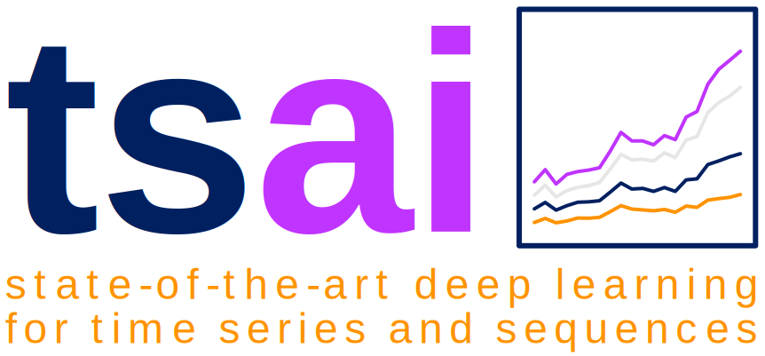

# tsai (by timeseriesAI)
> State-of-the-art Deep Learning for Time Series and Sequences in Pytorch / fastai

  

  

  

`tsai`is an open-source deep learning package built on top of Pytorch & fastai focused on state-of-the-art techniques for time series classification, regression and forecasting.

Here's the link to the [documentation](https://timeseriesai.github.io/tsai/).

## What's new?

### tsai: 0.2.4 (Nov 10th, 2020)

* Added support to Pytorch 1.7.

### tsai: 0.2.0 (Nov 3rd, 2020)

`tsai` 0.2.0 is a major update to the tsai library. These are the major changes made to the library:

* New tutorial nbs have been added to demonstrate the use of new functionality like: 
    * Time series **data preparation**
    * Intro to **time series regression**
    * TS archs comparison
    * **TS to image** classification
    * TS classification with **transformers**
    
* Also some tutorial nbs have been updated like **Time Series transforms**
* More ts data transforms have been added, including ts to images.
* New callbacks, like the state of the art noisy_student that will allow you to use unlabeled data.
* New time series, state-of-the-art models are now available like XceptionTime, RNN_FCN (like LSTM_FCN, GRU_FCN), TransformerModel, TST (Transformer), OmniScaleCNN, mWDN (multi-wavelet decomposition network), XResNet1d.
* Some of the models (those finishing with an plus) have additional, experimental functionality (like coordconv, zero_norm, squeeze and excitation, etc).

The best way to discocer and understand how to use this new functionality is to use the tutorial nbs. I encourage you to use them!

## Install

You can install the **latest stable** version from pip:

`pip install tsai`

Or you can install the **bleeding edge** version of this library from github by doing:

`pip install git+https://github.com/timeseriesAI/tsai.git@master`

## How to get started

To get to know the `tsai` package, I'd suggest you start with this notebook in Google Colab: **[01_Intro_to_Time_Series_Classification](https://colab.research.google.com/github/timeseriesAI/tsai/blob/master/tutorial_nbs/01_Intro_to_Time_Series_Classification.ipynb)**

It provides an overview of a time series classification problem using fastai v2.

If you want more details, you can get them in nbs 00 and 00a.

To use tsai in your own notebooks, the only thing you need to do after you have installed the package is to add this:

`from tsai.all import *`
